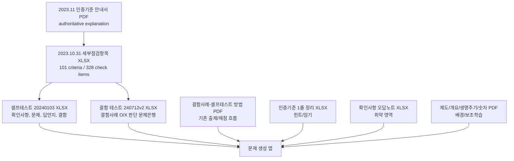

# ISMS-P Source Relationship Analysis

## Purpose

This note maps the provided ISMS-P study files into a source hierarchy for an app that generates practice questions. The intended app should treat the 2023.11 certification standard guide as the authoritative conceptual basis, then use the spreadsheet sources as machine-readable question banks.

## Source Hierarchy

### 1. Authoritative Basis

- `★정보보호 및 개인정보보호 관리체계 인증기준 안내서(2023.11).pdf`
  - Role: official narrative basis for ISMS-P certification criteria, examples, review intent, and defect interpretation.
  - Extracted profile: 264 pages; dense references to certification criteria, check items, and defects.
- `ISMS-P_인증기준_세부점검항목(2023.10.31).xlsx`
  - Role: machine-readable master for the 2023.11 basis.
  - Extracted structure: 101 certification criteria and 328 detailed check items.
  - Domain split:
    - `1.관리체계 수립 및 운영`: 16 criteria
    - `2.보호대책 요구사항`: 64 criteria
    - `3.개인정보 처리단계별 요구사항`: 21 criteria

Use the PDF for explanation and interpretation, but use the 2023.10.31 spreadsheet as the primary import source for structured app data.

### 2. Core Question Bank Sources

- `ISMS-P_인증기준_셀프테스트_20240103.xlsx`
  - Role: self-test workbook containing confirmation-question sources, generated question sheets, answer sheets, and defect-case sheets.
  - Coverage: all 101 official criteria overlap with the 2023.10.31 master.
  - Important sheet families:
    - `1.1 확인(일반)`, `1.3 확인(가상)`, `1.5 확인(금융)`, `1.7 확인(통합)`: check-item/question source variants.
    - `1.2`, `1.4`, `1.6`, `1.8 ... 문제`: generated 50-item question samples.
    - `2.1 결함`: defect-case source.
    - `2.2 결함 문제`, `2.3 결함 답안지`: generated defect questions and answer workflow.
- `ISMS-P 인증기준 결함 테스트_240712v2.xlsx`
  - Role: strongest structured source for defect-case problem generation.
  - Extracted structure:
    - 381 correct defect-case-to-criterion pairs.
    - 1,143 false judgment rows.
    - 762 unique defect-case text rows across true/false combinations.
    - 50 generated prompts and 250 generated answer options in the `문제 출제` sheet.
  - Important sheets:
    - `(참고) 소스1`: source table with criterion code, criterion name, defect case, generated judgment sentence, and truth flag.
    - `(참고) 소스2`: flattened judgment statement plus truth flag.
    - `(참고) 출제로직`: randomized question assembly logic.
    - `문제 출제`: visible generated quiz output.

For the first app version, these two workbooks should drive the actual problem generator.

### 3. Existing Workflow Guide

- `인증기준 결함사례-셀프테스트 방법.pdf`
  - Role: describes the current spreadsheet workflow rather than adding new source content.
  - Workflow captured:
    - Select the defect question sheet.
    - Trigger recalculation/edit mode to generate 50 new questions.
    - Copy hidden answer columns into the answer sheet as values.
    - User selects the matching certification criterion; the sheet marks answers as O/X.
  - App implication: reproduce this as an interactive quiz flow with hidden answers until submission, random regeneration, answer review, and weak-area tracking.

### 4. Learning Aids And Feedback Sources

- `인증기준 1줄 정리.xlsx`
  - Role: concise mnemonic layer for criteria.
  - Coverage: 101 official criteria.
  - App use: show after answer submission, build flashcards, or generate hints.
- `ISMS-P 정리.xlsx`
  - Role: study notes and mnemonics not primarily code-linked.
  - App use: optional explanation/hint layer after the core question bank is working.
- `isms 확인사항 오답노트.xlsx`
  - Role: historical learner feedback.
  - Extracted structure:
    - `확인사항오답`: 154 nonempty rows, 31 unique criteria.
    - `결함오답`: 152 nonempty rows, 54 unique criteria.
    - Combined coverage: 65 official criteria.
  - App use: seed weak-area recommendations and priority review sets.
- `숫자로 보는 개인정보보호_240225.pdf`, `2024_개인정보생명주기.pdf`
  - Role: memorization/legal context aids.
  - App use: optional supporting cards for privacy-law-heavy questions.

### 5. Context And Domain Supplement Sources

- `ISMS-P 인증제도 안내서(2024.07) (1).pdf`
  - Role: certification process and institutional context, not the main criteria basis.
  - App use: onboarding, exam/background explanations, certification process questions.
- `ISMSP개요.pdf`, `ISMSP개요(1).pdf`
  - Role: overview slides. Text extraction was weak, so these should be treated as visual/context aids unless OCR is added.
- `가상자산거래소_ismsp세부항목정리.pdf의 사본`
  - Role: domain-specific virtual-asset exchange supplement. Text extraction was weak, but the file aligns with the self-test workbook's virtual/integrated variants.
  - App use: later domain scenario pack, especially for virtual-asset examples.

### 6. Legacy Or Alternate Criteria Lists

- `(7의2)ISMS-P_인증기준_세부점검항목.xlsx`
  - Extracted structure: 62 criteria and 232 check items.
- `(7의3)ISMS-P_인증기준_세부점검항목.xlsx`
  - Extracted structure: 65 criteria and 222 check items.
- `ISMS 세부항목 목록.xlsx`
  - Role: compact criteria/code list.

These should not be the first master source because the user specified the 2023.11 guide as the basis and the 2023.10.31 spreadsheet matches the full 101-criteria structure. Keep them as comparison/reference material.

## Relationship Model

## Recommended App Data Model

- `criteria`
  - `code`, `name`, `domain`, `group_code`, `group_name`, `requirement_text`, `source_version`
- `check_items`
  - `criteria_code`, `question_text`, `variant`, `source_file`, `source_sheet`
- `defect_cases`
  - `defect_text`, `correct_criteria_code`, `criteria_name`, `source_file`, `source_sheet`
- `defect_judgment_options`
  - `defect_case_id`, `candidate_criteria_code`, `candidate_criteria_name`, `statement_text`, `is_correct`
- `question_templates`
  - `type`, `prompt`, `choice_count`, `correct_count`, `difficulty_rule`
- `generated_questions`
  - `template_id`, `question_text`, `choices`, `answer`, `explanation_source`
- `user_attempts`
  - `question_id`, `selected_answer`, `is_correct`, `attempted_at`
- `weak_areas`
  - `criteria_code`, `wrong_count`, `last_wrong_at`, `source`

## Recommended Question Types

1. Check-item matching
   - Input: major confirmation question.
   - Task: choose the matching ISMS-P criterion code/name.
   - Primary source: self-test confirmation sheets.

2. Defect-case matching
   - Input: defect case.
   - Task: choose the criterion that the defect belongs to.
   - Primary source: `2.1 결함` and defect-test source tables.

3. Auditor judgment multiple-select
   - Input: several statements of the form "this defect belongs to this criterion."
   - Task: select all correct statements.
   - Primary source: `ISMS-P 인증기준 결함 테스트_240712v2.xlsx`.

4. O/X judgment
   - Input: one defect-case judgment statement.
   - Task: true/false.
   - Primary source: `(참고) 소스2`.

5. Weak-area review
   - Input: previously missed criteria or imported wrong-note rows.
   - Task: repeated practice with higher sampling weight.
   - Primary source: `isms 확인사항 오답노트.xlsx` plus app attempts.

## Defect-Test Workbook Logic

The detailed logic of `ISMS-P 인증기준 결함 테스트_240712v2.xlsx` is captured separately in `ai/analysis/defect-test-workbook-logic.md`.

In short, the workbook builds each question from 3 false defect judgment statements and 2 true defect judgment statements, shuffles the 5 options, and scores a question as correct only when exactly the 2 true options are selected.

## Implementation Priority

1. Import the 2023.10.31 criteria/check-item spreadsheet as the master code table.
2. Import the defect-test workbook's `(참고) 소스1` and `(참고) 소스2` as the first question bank.
3. Import self-test confirmation sheets as the second question bank.
4. Implement a 50-question random session matching the current spreadsheet workflow.
5. Add answer review, weak-area tracking, and one-line hints.
6. Add domain packs such as virtual-asset exchange and finance variants after the core generator works.

## Risks And Notes

- Some PDFs appear image-heavy or have weak text extraction. Treat them as context unless OCR is added.
- The two `(7의2)` and `(7의3)` spreadsheets are smaller alternate/legacy structures and should not override the 2023.11 basis.
- Generated questions should always validate that every referenced criterion code exists in the 101-code master table.
- Explanations should cite the 2023.11 guide or the master check-item spreadsheet, not only a generated workbook row.
